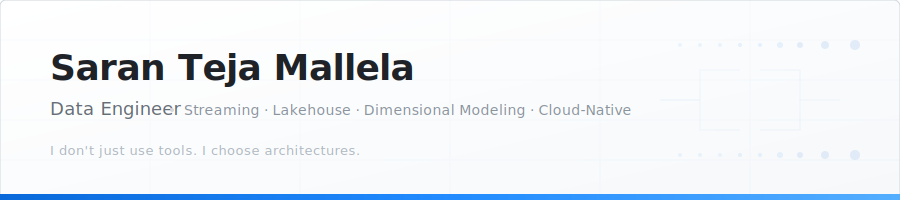
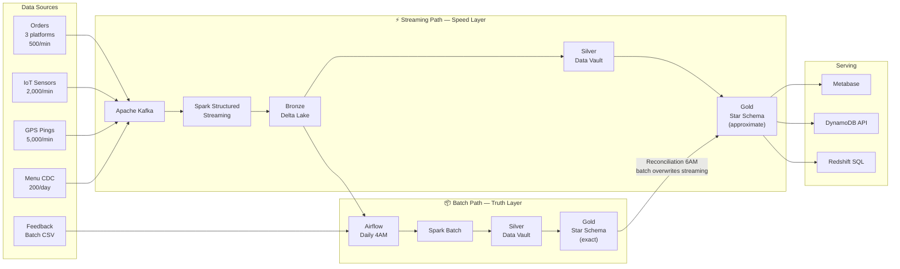
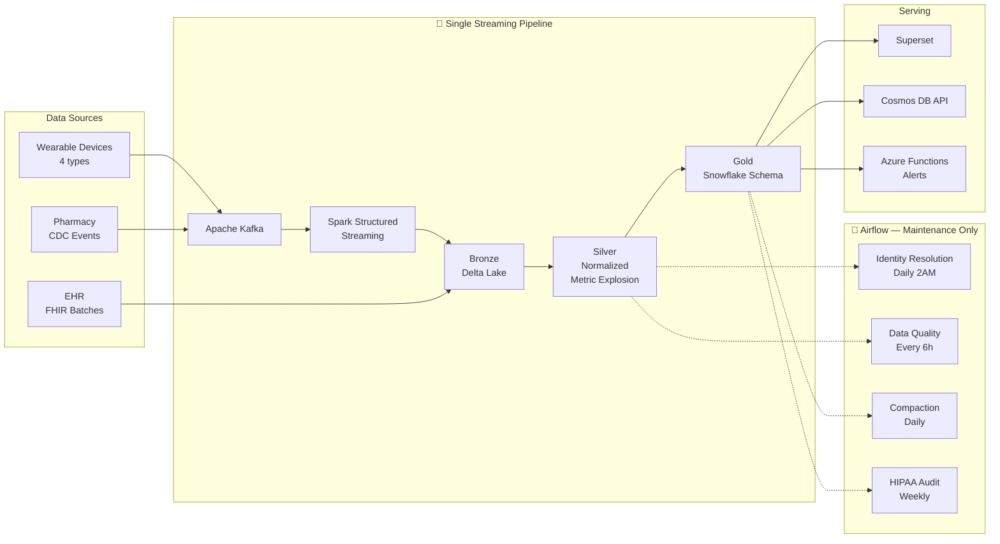
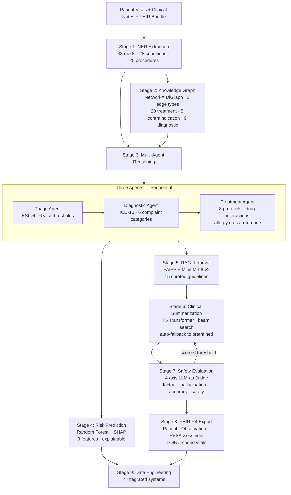

<picture>
  <source media="(prefers-color-scheme: dark)" srcset="assets/banner-dark.svg">
  <source media="(prefers-color-scheme: light)" srcset="assets/banner-light.svg">
  
</picture>

<p align="center">
  <a href="https://www.linkedin.com/in/saranteja2002"></a>&nbsp;
  <a href="mailto:stmallela.us@gmail.com"></a>&nbsp;
  <a href="https://github.com/Nerdboss-stm"></a>&nbsp;
  <a href="https://www.researchgate.net/publication/372388571"></a>&nbsp;
  <a href="https://ieeexplore.ieee.org/document/10101155"></a>
</p>

---

M.S. Data Science, **University of Houston** (4.0 GPA) · B.Tech CS · **3 published papers** (IEEE, ResearchGate) · **AWS Solutions Architect** certified.

I build end-to-end data platforms — from Kafka ingestion to dimensional models to serving layers. The three flagship projects below use **deliberately different architectures** because their data behaves differently. Lambda for stateful order lifecycles. Kappa for append-only sensor streams. Multi-agent pipeline for clinical AI. Data Vault where schemas conflict. Star where dimensions are flat. Snowflake where hierarchies run deep.

Choosing the right pattern matters more than knowing every tool.

Currently **Software Engineer at Url Systems Inc** · Previously University of Houston.

---

## Architecture Portfolio

Three production-grade platforms. Different architectures, different modeling, different cloud providers — each chosen for a reason.

<table>
<tr>
<td width="33%" valign="top">

### 🍔 GhostKitchen

[](https://github.com/Nerdboss-stm/ghostkitchen)


**Real-Time Dark Kitchen Intelligence Platform**

50 kitchens · 10 cities · 3–5 brands per kitchen  
Orders from Uber Eats, DoorDash, OwnApp  
Kitchen IoT · Delivery GPS · Menu CDC

</td>
<td width="33%" valign="top">

### 🫀 PulseTrack

[](https://github.com/Nerdboss-stm/pulsetrack)


**Wearable Health Analytics & Anomaly Detection**

100K patients · 4 device types · 3 data sources  
Wearable telemetry · EHR FHIR · Pharmacy CDC  
HIPAA-compliant · Personal baseline anomaly detection

</td>
<td width="33%" valign="top">

### 🧬 HERA v4

[](https://github.com/Nerdboss-stm/hera-healthcare-ai)


**Healthcare Reasoning & Analytics Platform**

Multi-agent clinical AI + data engineering  
23 FastAPI endpoints · 7 DE systems · 9-stage pipeline  
Live on AWS · Prometheus + Grafana · FHIR R4

</td>
</tr>
</table>

### Why different architectures?

```
                    GhostKitchen                   PulseTrack                     HERA v4
                    ──────────────                 ──────────────                 ──────────────
  Data nature       Stateful (order lifecycle)     Append-only (sensor readings)  Multi-stage AI pipeline
  Architecture      Lambda (batch + streaming)     Kappa (streaming only)         9-stage Command Center
  Why?              Orders get cancelled/refunded  Heart rate of 72 bpm doesn't   Clinical reasoning needs
                    → need batch recomputation     get "corrected" — one          sequential stages: NER →
                    for exact revenue numbers      pipeline handles everything    agents → ML → RAG → eval

  Silver model      Data Vault 2.0                 Normalized + metric explosion  Star schema warehouse
  Gold model        Star Schema                    Snowflake Schema               Hourly aggregations

  Late data         DLQ → nightly reconciliation   Same pipeline, no DLQ          DLQ in event streaming
  Airflow role      Conductor (orchestrates batch)  Janitor (maintenance only)    Custom 16-task ETL DAG
  Cloud             AWS (S3, Redshift, DynamoDB)   Azure (Blob, Cosmos DB)        AWS App Runner + ECR
  Serving           Metabase                       Apache Superset                Grafana + Prometheus
```

---

### GhostKitchen — Deep Dive

<details>
<summary><b>Lambda Architecture — dual-path data flow</b></summary>
<br/>



**Why Lambda here?** Orders transition through states: `placed → confirmed → preparing → ready → picked_up → delivered` (or cancelled at any stage). A delivered order might be refunded 2 hours later, changing final revenue. The streaming path gives dashboards fast-but-approximate numbers. The daily batch path reprocesses 48 hours of Bronze to produce exact numbers and overwrites the streaming Gold. Delta Lake MERGE makes this atomic overwrite safe.

</details>

<details>
<summary><b>Data Vault 2.0 (Silver) — why not Star Schema here?</b></summary>
<br/>

Three platforms define the same entities differently:

| Field | Uber Eats | DoorDash | OwnApp |
|-------|-----------|----------|--------|
| Customer ID | `customer_uid` | `dasher_customer_id` | `user_id` |
| Order total | `total_amount` (float) | `order_value` (float) | `amount_cents` (integer!) |
| Timestamp | `order_timestamp` | `created_at` | `timestamp` |

Star Schema would force premature alignment. Data Vault solves this:
- **Hubs** unify identity — one `hub_customer` row per real person, regardless of platform
- **Satellites** preserve source-specific attributes with full SCD2 history
- **Links** capture relationships (which order → which customer → which kitchen+brand)

Gold then transforms Data Vault → Star Schema for analyst-friendly 2-table joins.

**Key tables:**

```
HUBS                    LINKS                       SATELLITES
hub_customer            link_order_customer          sat_customer_profile (SCD2)
hub_order               link_order_kitchen_brand     sat_order_details
hub_kitchen                                          sat_order_status (state machine)
hub_menu_item                                        sat_menu_item_details (SCD2)
```

</details>

<details>
<summary><b>Identity resolution — 3 platforms → 1 customer</b></summary>
<br/>

```
customer_identity_bridge
├── platform: uber_eats / doordash / own_app
├── platform_customer_id: ue_cust_44821
├── email_hash: MD5(normalized email)
├── phone_hash: MD5(phone) — nullable
├── match_confidence: 1.0 (exact) ... 0.6 (fuzzy)
└── match_method: exact_email / fuzzy_name_address / manual_override
```

**Algorithm:**
1. Normalize emails (lowercase, trim)
2. Group all platform IDs by `email_hash`
3. Assign one `customer_key` per email group
4. Null emails → fuzzy match on `name + delivery_address`
5. Store `match_method` + `confidence` for auditability

A customer ordering from Uber Eats AND DoorDash AND the direct app resolves to **one row** in `dim_customer`. Their cross-platform behavior is now visible: average order value per platform, platform loyalty, cannibalization analysis.

</details>

<details>
<summary><b>Dimensional model (Gold) — fact tables & grains</b></summary>
<br/>

| Fact Table | Grain | Why this grain |
|------------|-------|---------------|
| `fact_order` | 1 row per order (final state) | CEO needs: count, revenue, delivery time |
| `fact_order_state_history` | 1 row per order × status change | Ops needs: bottleneck analysis per state |
| `fact_sensor_hourly` | 1 row per kitchen × sensor × zone × hour | 1.3M raw events/day → hourly rollup for dashboards. Atomic stays in Silver for ML. |
| `fact_delivery_trip` | 1 row per delivery | Aggregated from raw GPS pings. Pings too granular for dashboards. |

**Dual-grain strategy:** Atomic events in Silver for correctness + pre-aggregated in Gold for performance. Every fact table has a deliberate grain decision documented.

**SCD types used:** Type 0 (zones — never change) · Type 1 (kitchens — overwrite) · Type 2 (menu items, customers — full history)

**Bridge tables:** `bridge_kitchen_brand` (M:M — one kitchen runs multiple brands) · `customer_identity_bridge` (cross-platform resolution)

</details>

---

### PulseTrack — Deep Dive

<details>
<summary><b>Kappa Architecture — single streaming engine</b></summary>
<br/>



**Why Kappa here?** A heart rate reading of 72 bpm at 2:34pm doesn't get "corrected" later. It's an immutable measurement. No need for Lambda's dual-pipeline complexity. One streaming engine handles real-time, late-arriving data (30% of events arrive hours late from batch sync), AND backfills (reset Kafka offsets, replay through same code). Same pipeline, same logic, one truth.

**Airflow's role is completely different here.** In GhostKitchen, Airflow is the **conductor** — it orchestrates the batch ETL path. In PulseTrack, Airflow is the **janitor** — it handles maintenance (identity resolution refresh, data quality sweeps, Delta compaction, HIPAA audits) while the streaming pipeline runs continuously on its own.

</details>

<details>
<summary><b>Metric explosion — the core Silver transformation</b></summary>
<br/>

Bronze stores one row per device reading with nested metrics:
```json
{"device_id": "SW-001", "metrics": {"heart_rate_bpm": 72, "spo2_pct": 98, "hrv_ms": 45}}
```

Silver **explodes** this to one row per metric:
```
SW-001 | heart_rate_bpm | 72.0 | ✅ valid
SW-001 | spo2_pct       | 98.0 | ✅ valid
SW-001 | hrv_ms         | 45.0 | ✅ valid
```

Why? Anomaly detection, dashboards, and aggregations all operate on individual metrics. Nested JSON forces complex extraction on every query. Explosion is done once in Silver, benefitting every downstream consumer.

**Quality flags (not dropped):**

| Metric | Valid Range | Outside range → |
|--------|-------------|-----------------|
| heart_rate_bpm | 30–220 | `is_valid = false` (kept for anomaly detection) |
| spo2_pct | 70–100 | `is_valid = false` |
| blood_glucose_mgdl | 40–400 | `is_valid = false` |
| skin_temp_celsius | 30–42 | `is_valid = false` |

Invalid readings are **never dropped** — they're flagged and kept because out-of-range values may indicate genuine medical events that anomaly detection should evaluate.

</details>

<details>
<summary><b>Snowflake Schema (Gold) — why not Star here?</b></summary>
<br/>

Healthcare dimensions are **deeply hierarchical:**
- ICD-10 codes: Chapter → Category → Specific Code (3 levels)
- Medications: Drug Class → Medication → Dosage → Patient Assignment
- Devices: Device Type → Firmware Version → Patient Reassignment

Star Schema would create a "kitchen sink" `dim_patient` with 50+ columns. Snowflake normalizes these hierarchies into separate dimension tables with foreign keys.

**Fact tables:**

| Table | Grain |
|-------|-------|
| `fact_vital_reading` | 1 row per patient × metric × timestamp (atomic) |
| `fact_vital_daily_summary` | 1 row per patient × metric × day (pre-aggregated) |
| `fact_activity_session` | 1 row per exercise session |
| `fact_lab_result` | 1 row per lab test |
| `fact_prescription_fill` | 1 row per pharmacy dispense |
| `fact_anomaly_alert` | 1 row per detected anomaly |

**Dimension tables with SCD types:**

| Dimension | SCD | Why |
|-----------|-----|-----|
| `dim_patient` | Type 2 | Lean — no conditions/meds crammed in |
| `dim_medication` | Type 2 | Hardest SCD2: start/stop/dosage change/restart |
| `dim_condition` → `dim_condition_category` | Type 2 → Type 0 | ICD-10 hierarchy normalized |
| `dim_device` | Type 2 | Firmware versions + patient reassignment |
| `dim_drug_class` | Type 0 | Classification doesn't change |

</details>

<details>
<summary><b>Identity resolution — 7 identifier types → 1 patient</b></summary>
<br/>

The hardest engineering problem in PulseTrack. A single patient may appear as:

```
device_account_id  →  email  →  hospital_mrn  →  pharmacy_id  →  insurance_id  →  phone_hash  →  ssn_hash
```

**Multi-hop graph matching:** `device_account` links to `email`, `email` links to `hospital_mrn`, `hospital_mrn` links to `pharmacy_id` — all resolving to one unified `patient_key` via the `patient_identity_bridge` table (1,159 rows for 100K user dataset).

This is significantly more complex than GhostKitchen's 3-platform identity resolution because healthcare identifiers are fragmented across completely independent systems (hospitals, pharmacies, insurers, device manufacturers) with no shared login.

</details>

<details>
<summary><b>Anomaly detection — personal baselines, not population thresholds</b></summary>
<br/>

A runner with resting HR 52 showing HR 85 is **more concerning** than a sedentary person at HR 85. Population-level thresholds miss this.

**Per-patient rolling statistics** (mean, σ for each metric over 30 days). New reading compared against personal baseline. Deviation > 2σ = anomaly alert.

- **State:** Keyed by `(patient_key, metric_name)`. Each key stores running stats + circular buffer.
- **Backed by:** RocksDB state store in Spark Structured Streaming.
- **TTL:** 90 days for inactive patients.
- **Output:** `fact_anomaly_alert` in Gold → Azure Functions → email/SMS notifications.

</details>

<details>
<summary><b>HIPAA compliance — built in, not bolted on</b></summary>
<br/>

- **De-identification:** Gold uses `age_bracket` (not exact age), `city` (not address), no names
- **Encryption:** Delta Lake files encrypted at rest
- **Access control:** `data_engineer` (all layers), `clinical_analyst` (Gold only, PII masked), `researcher` (Gold, fully de-identified)
- **Deletion:** Delta Lake DELETE across all layers → verification sweep → audit log
- **Retention:** HIPAA requires 7-year retention. Patient deletion = de-identify PII but keep analytical record.
- **Audit:** Weekly `dag_hipaa_audit` scans for PII leakage across all layers

</details>

---

### HERA v4 — Deep Dive

[](https://github.com/Nerdboss-stm/hera-healthcare-ai/actions)
[](https://github.com/Nerdboss-stm/hera-healthcare-ai)
[](https://3wihdymitc.us-east-1.awsapprunner.com)


Production-grade healthcare AI platform in two layers: **AI Layer** (multi-agent clinical reasoning, RAG, biomedical NER, risk prediction, FHIR R4) and **Data Engineering Layer** (event streaming, column-level lineage, data quality, star schema warehouse, ETL, CDC, data catalog). Both unified through a **Command Center** that runs all 9 stages as a single pipeline per patient encounter. Deployed on **AWS App Runner** via GitHub Actions CI/CD.

<details>
<summary><b>9-stage Command Center pipeline</b></summary>
<br/>



One `POST /api/command-center` runs all 9 stages per patient encounter. No manual orchestration. Stage 7 (Safety Evaluation) has a **feedback loop** — if the score is below threshold, it triggers re-summarization with RAG context injection.

**Consensus score:** `0.3 × risk + 0.4 × confidence + 0.3 × evidence_grade`

</details>

<details>
<summary><b>Multi-agent clinical reasoning — why agents, not a monolithic LLM</b></summary>
<br/>

Clinical reasoning is multi-step. A single LLM call can't provide the auditability, separation of concerns, and protocol adherence required in healthcare.

| Agent | Input | Output | Method |
|-------|-------|--------|--------|
| **Triage (ESI v4)** | Vitals + complaint | ESI level 1–5 | 6 vital thresholds × 4 levels + high-acuity keywords + resource estimation |
| **Diagnostic (ICD-10)** | Triage + NER entities | Differential diagnoses with probabilities | Evidence overlap − rule-out penalty + acuity boost + age factor |
| **Treatment** | Diagnosis + patient history | Treatment plan | 8 protocols by ICD-10 + drug interaction checking (5 pairs) + allergy cross-reference |

The orchestrator chains all three and records a **full audit trail** (JSONB in PostgreSQL). Every decision is traceable.

**Key design decision:** RAG over fine-tuning for medical knowledge. Guidelines change — RAG enables hot-swap without retraining, and citations provide provenance.

</details>

<details>
<summary><b>Data Engineering layer — 7 systems, zero external dependencies</b></summary>
<br/>

Each system is ~200–500 lines of focused Python implementing production-faithful patterns:

| System | Lines | What it does |
|--------|-------|-------------|
| **Event Streaming** | 422 | Kafka-style with schema registry (5 schemas), MD5 partitioning, consumer groups, DLQ |
| **Column-Level Lineage** | 506 | DAG tracking 36+ nodes across 8 pipeline stages, `impact_analysis()`, PII flagging |
| **Data Quality** | 349 | 12 checks across 5 categories (schema, completeness, accuracy, consistency, freshness) |
| **Star Schema Warehouse** | 394 | `fact_clinical_encounters` (22 cols) + 4 dimensions + hourly aggregation |
| **ETL Orchestrator** | 437 | 16-task DAG with topological sort, retry, SLA monitoring, upstream failure propagation |
| **CDC** | 246 | Before/after snapshots, SHA-256 checksums, field-level diffs, event replay |
| **Data Catalog** | 499 | 12 datasets with PII tracking, freshness SLAs, relevance-scored search |

**Why custom over Airflow/Kafka/dbt?** Zero external dependencies. Production-faithful patterns that run with just `pip install`. Demonstrates understanding of the internals, not just tool configuration.

**ETL DAG execution flow:**
```
ingest → validate → extract_entities → build_kg
                  → run_triage → run_diagnosis → run_treatment
                  → predict_risk
                                  run_diagnosis → retrieve_rag → generate_summary → evaluate_safety
                                                                                          ↓
export_fhir ← [run_treatment, predict_risk, generate_summary, evaluate_safety]
    ├── load_warehouse → emit_cdc → update_catalog
    └── track_lineage → update_catalog
```

</details>

<details>
<summary><b>Safety evaluation — LLM-as-Judge over ROUGE</b></summary>
<br/>

ROUGE can't detect hallucinations or clinically dangerous errors. HERA uses a 4-axis evaluation:

| Axis | Weight | Method |
|------|--------|--------|
| Factual consistency | 0.30 | Keyword overlap + 7 contradiction pair detection |
| Hallucination | 0.25 | Entity precision/recall + fabricated claim detection |
| Medical accuracy | 0.25 | 157 valid terms + dangerous dosage checks (5 drugs) |
| Clinical safety | 0.20 | 3 dangerous regex patterns + allergy cross-check |

Overall score = weighted sum. If below threshold → **feedback loop** re-triggers summarization with RAG context.

</details>

<details>
<summary><b>Infrastructure — deployed, monitored, tested</b></summary>
<br/>

**Deployment pipeline:**
```
Push to main → GitHub Actions CI (lint + 104 tests + Docker build) → ECR → AWS App Runner auto-deploys
```

**Observability (Prometheus + Grafana):**
- 17-panel Grafana dashboard (auto-provisioned): System Health, Clinical Risk & Triage, API Performance, Pipeline & Data Engineering
- Prometheus scrapes `/metrics` every 5s: `hera_requests_total`, `hera_request_failures_total`, `hera_request_latency_seconds`
- Alert rule: `TooManyHighRisk` fires when `high_risk_predictions > 3` for 30s

**PostgreSQL** (5 tables): `patient_predictions`, `summaries`, `clinical_reasoning_sessions`, `ner_extractions`, `evaluation_reports` — all populated automatically per API call.

**Middleware:** API key auth + rate limiting (30/min anon, 60/min auth) + HIPAA audit trail with trace IDs.

**Cost:** AWS App Runner 1 vCPU, 2GB RAM, auto-scales to 0 → ~$5–7/mo.

</details>

<details>
<summary><b>Key design decisions</b></summary>
<br/>

| Decision | Rationale |
|----------|-----------|
| Multi-agent over monolithic LLM | Clinical reasoning is multi-step. Agents provide separation of concerns and auditability. |
| RAG over fine-tuning for knowledge | Medical guidelines change. RAG enables hot-swap without retraining. Citations provide provenance. |
| FHIR R4 for interoperability | Mandated for US healthcare data exchange (21st Century Cures Act). |
| Random Forest + SHAP over deep learning | 9 features, binary target. "SpO2 and MAP drove this High Risk" is more valuable than marginal accuracy from a black box. |
| Column-level over table-level lineage | Field-level provenance for HIPAA compliance and impact analysis. Table-level is too coarse for healthcare governance. |
| Custom DE systems over Airflow/Kafka/dbt | Demonstrates understanding of internals. Zero dependencies. Production-faithful patterns in ~300 lines each. |
| Unified Command Center over microservices | One POST runs all 9 stages. Atomic processing. Decompose into microservices at 100K+ patients/day. |

</details>

---

## Other Projects

| Project | Stack | What it does |
|---------|-------|-------------|
| [**Real-Time Stock Pipeline**](https://github.com/Nerdboss-stm/Real-Time-Stock-Price-Pipeline) | Kafka · Spark · Airflow · S3 · Redshift · Tableau | Streaming stock market data → cloud warehouse → analytics dashboards |
| [**Quantum Image Processing**](https://github.com/Nerdboss-stm/Quantum-Computing-in-Image-Processing) | Qiskit · Python · Jupyter | Quantum computing approaches to classical image processing problems |
| [**Financial News Sentiment**](https://github.com/Nerdboss-stm/Financial-News-Sentiment-Classifier) | NLP · Python | Sentiment classification for financial news articles |

---

## Tech Stack

**Streaming & Ingestion**&nbsp;&nbsp;


**Batch Processing**&nbsp;&nbsp;


**Orchestration**&nbsp;&nbsp;


**Data Modeling**&nbsp;&nbsp;


**Data Quality**&nbsp;&nbsp;


**Cloud**&nbsp;&nbsp;


**Storage**&nbsp;&nbsp;


**Serving & BI**&nbsp;&nbsp;


**ML & AI**&nbsp;&nbsp;


**Languages**&nbsp;&nbsp;


**Infrastructure & APIs**&nbsp;&nbsp;


---

## Publications

| Paper | Venue | Link |
|-------|-------|------|
| Classification of Parkinson's Disease in Brain MRI Images Using Deep Residual CNN | ResearchGate | [Read →](https://www.researchgate.net/publication/372388571_CLASSIFICATION_OF_PARKINSON'S_DISEASE_IN_BRAIN_MRI_IMAGES_USING_DEEP_RESIDUAL_CONVOLUTIONAL_NEURAL_NETWORK) |
| Efficient Smart Micro-Scale Solar Power Management System for Rechargeable Nodes | IEEE | [Read →](https://ieeexplore.ieee.org/document/10101155) |
| Estimation of Periodontal Bone Loss Using SVM and Random Forest | IEEE | [Read →](https://ieeexplore.ieee.org/document/9835869) |

---

## Certifications

| Certification | Issuer |
|--------------|--------|
| Databricks Data Engineer Associate | Databricks |
| AWS Certified Solutions Architect | Amazon Web Services |
| Tableau Desktop Specialist | Tableau / Salesforce |
| UiPath Automation Developer Associate | UiPath |


---

## Education

| Degree | Institution | GPA |
|--------|------------|-----|
| **M.S. Engineering Data Science** | University of Houston (2023–2025) | **4.0 / 4.0** |
| **B.Tech Computer Science** | VR Siddhartha Engineering College | |

---

## GitHub Activity

<picture>
  <source media="(prefers-color-scheme: dark)" srcset="https://github.com/Nerdboss-stm/Nerdboss-stm/blob/output/github-snake-dark.svg" />
  <source media="(prefers-color-scheme: light)" srcset="https://github.com/Nerdboss-stm/Nerdboss-stm/blob/output/github-snake.svg" />
  
</picture>

<p align="center">
  
  
</p>
<p align="center">
  
</p>

---

<p align="center">
  <a href="mailto:stmallela.us@gmail.com"><b>stmallela.us@gmail.com</b></a>&nbsp;&nbsp;·&nbsp;&nbsp;
  <a href="https://www.linkedin.com/in/saranteja2002"><b>LinkedIn</b></a>&nbsp;&nbsp;·&nbsp;&nbsp;
  <a href="https://github.com/Nerdboss-stm"><b>GitHub</b></a>
</p>
